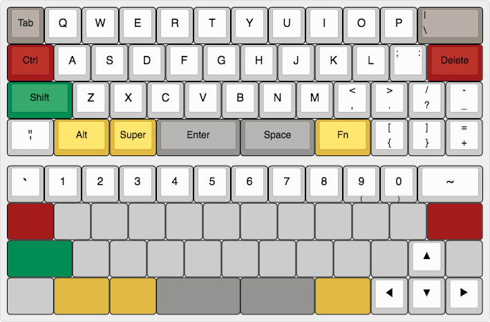
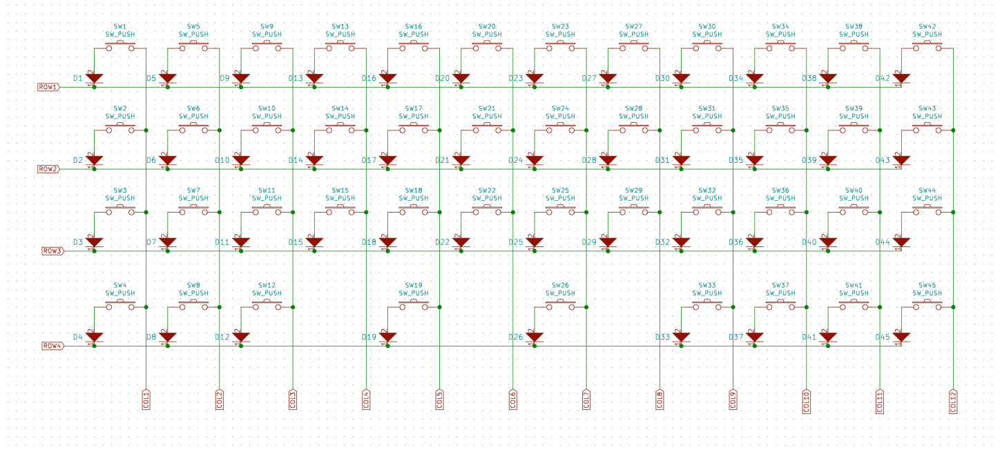
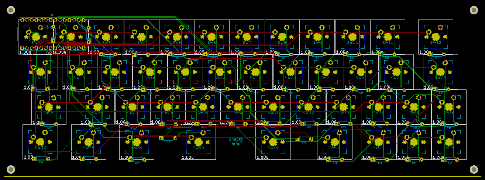

# Snackymini Keyboard

See more about design and PCB layout

**Layout:**

Inspired by MiniVan Arrow Layout http://www.keyboard-layout-editor.com/#/gists/174470794149140f43dd6c9b544c168c

**Schema:**

**PCB:**

**PCB render:**

## Parts
- 1x Teensy 3.2 with header pins
- 47x Cherry MX Switches (choose your color)
- 47x Key caps in various size
- 47x 1N4148 diodes

## How to use this repository?
First, you'll need to install [KiCad](http://kicad-pcb.org/), then you can open the PCB project in `hardware` folder to edit the PCB/Layout as you wish.

I have included the `snackymini-manufacturing-submission.zip` file containing all of the gerber files needed so you can send it to the manufacturer directly.

Ater having the PCB printed, you can use Arduino IDE (with Teensyduino installed) to compile the code in `firmware` folder, then upload it to your Teensy.
